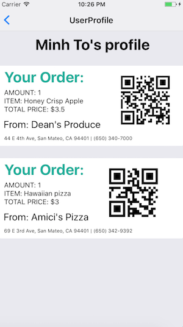

# angelhacks-2017: Nosh

Created during the 2017 Silicon Valley Angelhacks on Saturday, July 29, 2017 - Sunday, July 30, 2017 

Project description: Food waste in America is a current pressing environmental issue because waste that could feed individuals in need often end up in landfill because restaurant and grocery stores throw away perfectly good food. Nosh is mobile app to allow local food providers (gardeners, restaurants, farmers, grocery stores, etc.) to sell their food surplus to consumers at discounted prices 

## Registration/Login
Food providers and users can register separately and they will be immediately added to the Nosh network 

## User interface
From the user's home page, they are able to browse available food providers that have posted items (produce, leftover foods) on their sites.

Users can see these food providers locations in relations to their current locations to find the closest ones.

On each food provider's site, users can see what items have been posted, and the available quantity. They can claim an amount of each item. A confirmation will be sent to the user. The receipt contains a unique QR code that can be scanned when the user visits a local food provider to receive the produce that they have claimed.

All past transactions are available to view on the user's profile

## Restaurant/Food Provider interface
A restaurant or food provider can see all items and their quantities that they have posted. They can opt to make all items available. Upon choosing this option, users can see and claim all these items. To add any item, the food provider simply clicks on the "+" button on the bottom of the page. They will be asked to fill out a form with item name, quantity, and pricing.

Upon finishing the form, their site will be automatically updated with more new items on sale available for users to take.

## Creators
[Minh To](https://github.com/mnto)
[Teresa Liu](https://github.com/teresaliu20)
[Priya Sarkar](https://github.com/sarkarpm)

